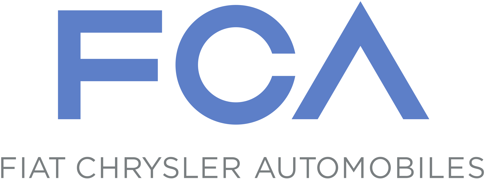
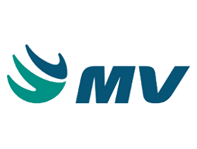

# Erasmo Soares

**Pragmatic Software Engineer** with over 17 years of experience in designing and delivering innovative solutions. I have worked on projects in healthcare, finance, and education, leveraging agile methodologies and modern technologies.

I have collaborated with major players such as Samsung TV and Motorola Solutions. Holding a Master's degree in Software Engineering, I am curious about languages and cultures. I am a continuous learner and enjoy sharing my knowledge.

I prioritize open dialogue, transparency, and respect; I believe these are the keys to effective team collaboration.

[Email](mailto:erasmosaraujo@gmail.com) / [LinkedIn](https://www.linkedin.com/in/erasmosoares/) / [GitHub](https://github.com/erasmosoares/)

---

## 🚀 Technical Summary

| Category | Skills Details |
| :--- | :--- |
| **Methodologies** | DevOps, Agile (Scrum, SAFe, Lean), CI/CD, TDD, BDD, DDD, Clean Architecture, Microservices, Event-Driven Architecture, BPMN, SOLID, MVC, MVVM, OOP, UML, SaaS, PaaS, IaaS, GRASP, DRY, n-tier, AOS, Serverless. |
| **Languages & Frameworks** | **C# (.NET Core / Framework)**, JavaScript, TypeScript, Python, Go, Node.js, React Native, Angular, Entity Framework, JQuery, Bootstrap, HTML5, CSS3, Visual Studio, PowerShell, VB.NET, Java EE, C++, Unity 3D. |
| **Cloud & DevOps** | **Microsoft Azure** (Functions, B2C, Service Bus, Blob Storage, App Services, AD, Key Vault, Monitor, Event Grid, DevOps, ML), Docker, Kubernetes, Helm, Terraform, Snyk, Dynatrace, SonarQube, Git, GitHub, GitLab. |
| **Databases** | SQL Server, Oracle (9i, 10g, 11g, 12c), PL/SQL, CockroachDB, MongoDB, CosmosDB, NHibernate, LINQ. |

---

## 💼 Professional Experience

**IA - Industrial Alliance (via Cofomo)**
**Senior Developer - OWASP Security Champion** | `June 2025 – Present` | Quebec

**Project Description:** Participating in the design, development, and integration of solutions within a financial environment.

**Key Responsibilities:**
*   Analyze business needs and translate them into robust technical solutions.
*   Serve as the primary liaison between development and security teams (Security Champion).
*   Review code and designs to identify and mitigate vulnerabilities (OWASP).
*   Act as a point of contact for incidents, audits, and compliance.
*   Participate actively in PI Planning and Agile/SAFe ceremonies.

**Achievements:**
*   **Leadership:** Rapidly evolved into a technical leader, co-presenting architecture reviews.
*   **Security Culture:** Established a proactive application security culture within the team.

---

**OQLF - Office québécois de la langue française (via Cofomo)**
**Cloud Developer** | `August 2024 – June 2025` | Quebec

**Project Description:** Design of a high-traffic cloud-native platform for linguistic management.

**Key Responsibilities:**
*   Designed and implemented cloud solutions on Microsoft Azure (scalability and resilience).
*   Developed and managed CI/CD pipelines in Azure DevOps.
*   Automated infrastructure provisioning (IaC) via Terraform.
*   Configured Azure B2C for secure identity management.
*   Supported and mentored junior developers.

**Achievements:**
*   **Backend Leader:** Complete backend architecture for a high-traffic platform (Daily Active Users).
*   **Innovation:** Implemented a document repository service using Service Bus and Blob Storage.

---

**MJQ - Ministry of Justice (via Cofomo)**
**Senior Developer - Lexius Program** | `April 2022 – August 2024` | Quebec

**Project Description:** Modernization of the Lexius ecosystem for secure judicial information sharing.

**Key Responsibilities:**
*   Designed and developed solutions using Azure cloud technologies.
*   Collaborated with Product Owners to align technical solutions with business needs.
*   Improved technical architecture documentation.
*   Maintained and enhanced monitoring (Azure Monitor, Application Insights).
*   Broke down user stories and conducted rigorous code reviews.

**Achievements:**
*   **Optimization:** Drastically reduced orphaned data by implementing transaction atomicity in Entity Framework.
*   **Feedback:** Received excellent evaluations for mentorship and operational efficiency.

---

**Revenu Québec - RQ (via Cofomo)**
**Analyst Programmer - FO-RB Project** | `January 2021 – March 2022` | Quebec

**Project Description:** Adaptation of mandatory billing for the restaurant sector (Sales Recording System - SRS).

**Key Responsibilities:**
*   Analyzed and programmed tasks according to strict Revenu Québec standards.
*   Participated in backlog estimation.
*   Applied TDD (Test Driven Development) practices to ensure quality.
*   Developed Web services allowing secure transaction consultation.

**Achievements:**
*   **SignalR:** Implemented real-time communication in a mobile web environment.
*   **Performance:** Optimized complex Oracle queries, improving system fluidity.

---

**CHU de Québec - Université Laval (via Cofomo)**
**Software Architect - CDO-Cristal-Net** | `April 2019 – December 2020` | Quebec

**Project Description:** Computerized Clinical Solution (DCI) for patient record management.

**Key Responsibilities:**
*   Conducted positioning studies and Proof of Concepts (PoC).
*   Determined hardware and software needs to optimize the Cristal-Net solution.
*   Implemented programming standards and ensured architectural robustness.

**Achievements:**
*   **Automation:** Developed PowerShell scripts and IaaS solutions to accelerate deployments.
*   **Collaboration:** Worked jointly with DBAs on complex data structures.

---

**Motorola Solutions (via CESAR)**
**Software Engineer** | `March 2015 – April 2019` | Brazil

**Project Description:** Development of high-frequency radio communication systems for public safety.

**Key Responsibilities:**
*   Multithreading and asynchronous programming (Task-based model).
*   Designed reusable components and cross-platform application examples.
*   Evaluated architecture via Motorola APIs.

**Achievements:**
*   **Reliability:** Successful delivery on mission-critical projects with extreme robustness requirements.
*   **Global:** Lead developer for technical coordination between Brazil, USA, and UK.

---

**Fiat Chrysler (via CESAR)**
**Software Engineer** | `January 2015 – July 2015` | Brazil

**Project Description:** "ToLigado" Voice Assistant for FIAT vehicles.

**Key Responsibilities:**
*   Created a PoC on Native Android and integrated with vehicle electronic components.

---

**Samsung SIDIA (via CESAR)**
**Software Engineer** | `October 2010 – December 2014` | Brazil

**Project Description:** Application development for Samsung Smart Hub (Smart TV).

**Key Responsibilities:**
*   Programmed game mechanics, physics, and UI using Unity 3D, C++, and NACL.

**Achievements:**
*   Integrated over 30 applications into the global store.

---

**MV Systems**
**Jr. Analyst Programmer** | `August 2008 – September 2010` | Brazil

**Project Description:** Massive migration of a hospital platform from Oracle Forms to Java Web.

**Key Responsibilities:**
*   PL/SQL development, Jasper Reports creation, and Java EE code maintenance.

**Achievements:**
*   Obtained Oracle Developer Associate certification within the first few months.

---

## 🎓 Education

### **Academic Background**

🎓 **M.Sc. in Software Engineering** | CESAR School, Brazil (`2015`).

🎓 **B.Sc. in Information Systems** | Estácio Univ., Brazil (`2012`).

*Confirmed MIDI equivalencies (Master's and Bachelor's).*

### 🎓 **Certifications**

---

 [**Microsoft Azure AI Fundamentals (AI-900)** — 2024 ](https://learn.microsoft.com/api/credentials/share/en-us/erasmosoares/5A364D13C9434782?sharingId=4C8702EBA6F0DB61)

Demonstrates fundamental AI concepts related to the development of software and services on Microsoft Azure to create AI solutions.
Role: AI Engineer

 [**Microsoft Azure Fundamentals (AZ-900)** — 2021](https://learn.microsoft.com/api/credentials/share/en-us/erasmosoares/5A364D13C9434782?sharingId=4C8702EBA6F0DB61)

Demonstrates foundational knowledge of cloud concepts, core Azure services, plus Azure management and governance features and tools.
Role: Administrator

 [**Oracle PL/SQL Developer Associate** — 2009 ](https://www.credly.com/badges/74a944db-bc0b-4633-941e-6ec8d9a19d05/linked_in_profile)

Demonstrated expertise in building database‑centric Internet applications for Oracle Database 10g / 11g / 12c.
Role: Application Developer

---

## 📚 Professional Development

`2025`
__Terraform: The Complete Guide__, Udemy  
[Reference: cUC-69464829-33d5-457a-9a64-c766c35d3aaa](https://www.udemy.com/certificate/UC-69464829-33d5-457a-9a64-c766c35d3aaa/?utm_campaign=email&utm_medium=email&utm_source=sendgrid.com)

`2021`
__The Ultimate Docker Course__, Code With Mosh  
[Reference: cert_5ykvppdb](https://codewithmosh.com/courses/1359863/certificate?certificate_first_issued=true)

`2021`
__Managing Microsoft Azure App Services__, Pluralsight  
[Reference: REP ID 4127](https://www.dropbox.com/s/hpe7fl11kpage1h/certificate-microsoft-azure-app-services.pdf?dl=0)

`2020`
__Node.js : The Complete Guide to Build RESTful APIS__, Udemy  
[Reference: UC-eef27311-9890-4db7-8b01-136e338a6d06](https://codewithmosh.com/courses/955852/certificate)

`2020`
__The Ultimate Git Course__, Code With Mosh  
[Reference: cert_ddf47pfr](https://codewithmosh.com/courses/887220/certificate?utm_source=student_mailer&utm_medium=email&utm_campaign=issued_certificate_notification)

`2020`
__The Ultimate React Native Series: Advanced Concepts__, Code With Mosh  
[Reference: cert_m58v86fk](https://codewithmosh.com/courses/955852/certificate)

`2020`
__Building Desktop Apps with Ionic and Electron__, Pluralsight  
[Reference: REP ID 4127](https://www.dropbox.com/s/rapipg5jcq4e7vb/certificate-building%20apps%20with%20ionic%20and%20electron.pdf?dl=0)

`2019`
__Clean Architecture: Patterns Practices, and Principles__, Pluralsight  
[Reference: REP ID 4127](https://www.dropbox.com/s/0gqwatabvgoi42k/certificate-clean%20architecture%20patterns%20practices%20and%20principles.pdf?dl=0)

`2019`
__ASP.NET Core Fundamentals__, Pluralsight  
[Reference: REP ID 4127](https://www.dropbox.com/s/ze9nn58dd4oycra/certificate-asp.net%20core%20fundamentals.pdf?dl=0)

`2019`
__Testing Angular 4 Apps with Jasmine__, Udemy  
[Reference: UC-6ZZN9ECE](https://www.udemy.com/certificate/UC-DTATIWLM/)

`2018`
__C# Intermediate: Classes, Interfaces and OOP__, Udemy  
[Reference: UC-DTATIWLM](https://www.udemy.com/certificate/UC-6ZZN9ECE/)

`2018`
__Angular Crash Course__, Udemy  
[Reference: UC-PE54G9UY](https://www.udemy.com/certificate/UC-PE54G9UY/)

`2018`
__C# Advanced Topics__, Udemy  
[Reference: UC-OU8JFJO7](https://www.udemy.com/certificate/UC-OU8JFJO7/)

`2018`
__Object-oriented Programming in JavaScript__, Udemy  
[Reference: UC-LZP96BML](https://www.udemy.com/certificate/UC-LZP96BML/)

`2018`
__Unit Testing for C# Developers__, Udemy  
[Reference: UC-IAR9H6DQ](https://www.udemy.com/certificate/UC-IAR9H6DQ/)

`2018`
__Entity Framework in Depth__, Udemy  
[Reference: UC-6IVPV8CY](https://www.udemy.com/certificate/UC-XED36OSN/)

`2018`
__The Complete ASP.NET MVC 5 Course__, Udemy  
[Reference: UC-XED36OSN](https://www.udemy.com/certificate/UC-6IVPV8CY/)

`2018`
__Parallel Programming with C# and .NET__, Udemy  
[Reference: UC-XED36OSN](https://www.udemy.com/certificate/UC-CGVD4OQB/)

`2018`
__Xamarin Forms: Build Native Cross-platform Apps with C#__, Udemy  
[Reference: UC-8NMZ99T4](https://www.udemy.com/certificate/UC-8NMZ99T4/)

---

## 🛠️ Personal Projects & Open Source

### Articles
- [Computer Vision and NLP for OCR Text Extraction (Supervised ML)](https://medium.com/gopenai/computer-vision-and-nlp-on-ocr-text-extraction-supervised-ml-d9b7c8de15a2) — Medium
- [Machine Learning in Action and Azure Automated Machine Learning](https://blog.gopenai.com/computer-vision-and-nlp-on-ocr-text-extraction-supervised-ml-d9b7c8de15a2) — Medium

### Sample Applications
- [CoinFac](https://commerce-vercel-ten.vercel.app) — Financial management tool for Windows and Mac. (Website)

### Libraries & Contributions
- [CoreEvents](https://www.nuget.org/packages/CoreEvents) — Event aggregator implementation for .NET Core, available on NuGet. (GitHub)
- [Chakra UI Table Pagination](https://github.com/alepiumetti/chakra-ui-table-w-pagination-sort-search) — Table component for Chakra UI. (GitHub)
- [Sample-node](https://github.com/erasmosoares/sample-node) — Template for RESTful API with Express and MongoDB. (GitHub)
- [NLP Pay Stub Reader](https://github.com/erasmosoares/NLP-PSR) — Project for automatic information extraction from pay stubs. (GitHub)

### Games
- [Something in the Mist](https://spitzergamestudio.itch.io/something-in-the-mist) - Game inspired by the short story "The Mist" - Stephen King.

## ⭐ Testimonials

#### Quality of Work
"Erasmo is thorough, precise, and organized in his actions and way of working, which shows he cares about quality work and has a very rigorous approach to tasks."

#### Pertinent Knowledge and Experience
"Erasmo is a versatile developer, experienced and above all very thorough and methodical, making him an undeniable asset to the project."

#### Interpersonal Relations and Team Spirit
"Appreciated by all, Erasmo successfully participates in meetings and pays sincere attention to his colleagues' opinions, thus fostering effective and respectful collaboration."

**REFERENCES AVAILABLE UPON REQUEST**