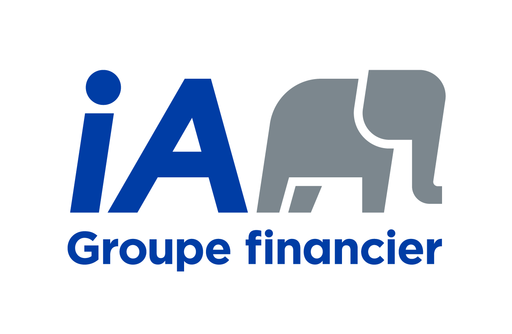
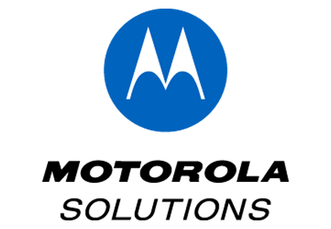
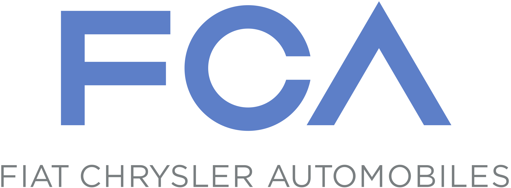
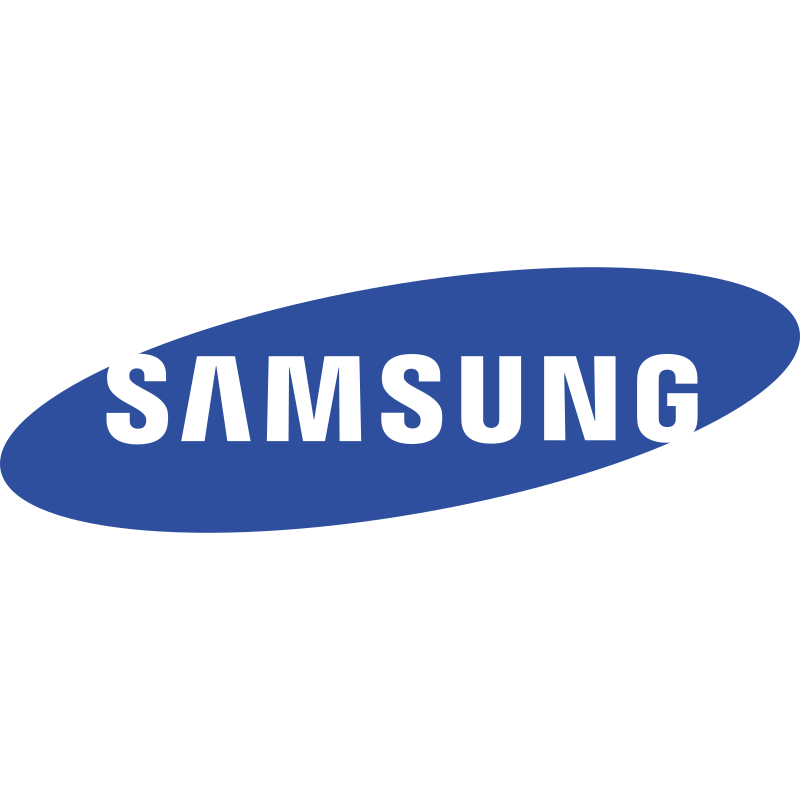
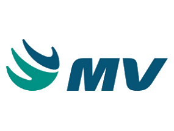
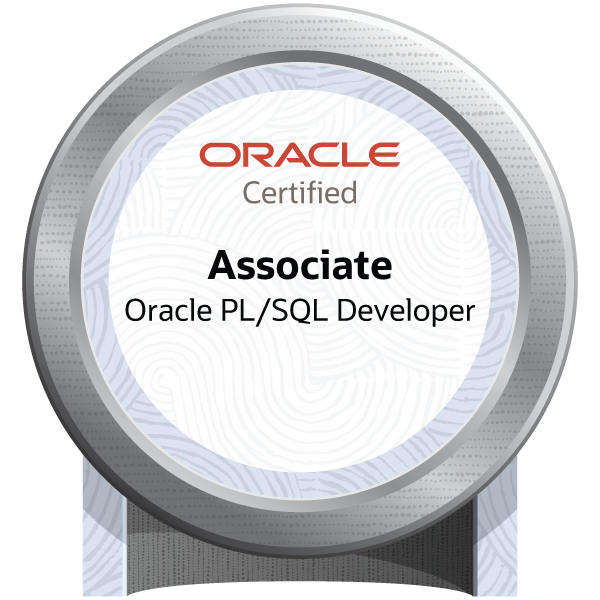

# Erasmo Soares

**Senior Software Engineer** with 18+ years of experience delivering software across insurance, government, healthcare, finance, and education. I specialize in designing and building secure, scalable backend and cloud solutions, with strong experience in C#, .NET, Microsoft Azure, distributed systems, REST APIs, messaging, SQL, Terraform, CI/CD, and Docker.

Throughout my career, I have taken on responsibilities beyond implementation, contributing to software architecture, technical design and decision-making, modernization initiatives, application security, observability, infrastructure automation, and engineering standards. I have also worked as a Software Architect and Lead Developer, collaborated across distributed teams, and mentored developers.

I am also exploring AI-enabled software development and agentic technologies through personal projects, building on my backend and cloud engineering background.

[Email](mailto:erasmosaraujo@gmail.com) / [LinkedIn](https://www.linkedin.com/in/erasmosoares/) / [GitHub](https://github.com/erasmosoares/)

---

## 🚀 Technical Summary

| Category | Skills Details |
| :--- | :--- |
| **Core** | **C#, .NET, Azure, Software Architecture, Distributed Systems, Technical Leadership** |
| **Backend** | ASP.NET, .NET Core, REST APIs, Messaging, Microservices, Entity Framework, Dapper, SignalR |
| **Cloud & DevOps** | **Microsoft Azure** (App Service, Functions, Service Bus, Blob Storage, B2C, Key Vault, Monitor, Application Insights), Terraform, Docker, Kubernetes, CI/CD, Azure DevOps, Snyk, Dynatrace, SonarQube, Git, GitHub, GitLab |
| **AI & Agentic Development** | **AI-enabled software development, Agents SDK, MCP, Python, Machine Learning, NLP, OCR** |
| **Engineering** | Clean Architecture, SOLID, DDD, TDD, BDD, Event-Driven Architecture, Observability, Application Security, Agile, Scrum, SAFe |
| **Data** | SQL Server, Oracle, PL/SQL, MongoDB, Cosmos DB, CockroachDB, LINQ |

---

## 💼 Professional Experience

**IA - Industrial Alliance (via Cofomo)**
**Senior Developer - OWASP Security Champion** | `June 2025 – Present` | Quebec

**Project Description:** Design, development, and integration of secure software solutions within an insurance and financial environment.

**Key Responsibilities:**
*   Partner with development teams and Product Owners to design, build, and integrate software solutions.
*   Contribute to infrastructure-as-code and CI/CD pipeline practices, supporting secure, repeatable deployments of .NET services across containerized environments.
*   Serve in an OWASP Security role, helping establish and promote a proactive application-security culture within the team.
*   Collaborate cross-functionally with Product, Architecture, Security, DevOps, and QA to drive technical decisions and deliver maintainable solutions.

**Achievements:**
*   **Security Leadership:** Helped establish and promote a proactive application-security culture through the OWASP Security Champion role.
*   **Security Development:** Completed the [iA Security Champions learning path](https://tryhackme.com/certificate/THM-1FQKA5DWOP).

---

**OQLF - Office québécois de la langue française (via Cofomo)**
**Cloud Developer** | `August 2024 – June 2025` | Quebec

**Project Description:** Design and delivery of a scalable, resilient, high-traffic cloud-native platform for linguistic management.

**Key Responsibilities:**
*   Designed and implemented a document repository service using Azure Service Bus for message flows and Azure Blob Storage for document storage.
*   Designed and delivered scalable, resilient cloud solutions on Microsoft Azure.
*   Configured core Azure services, including App Service and Azure B2C authentication.
*   Acted as principal backend developer, defining backend architecture and technical direction for a high-traffic public-facing platform built from the ground up.
*   Automated infrastructure provisioning and CI/CD delivery through Azure DevOps while mentoring developers.

**Achievements:**
*   **Backend Architecture:** Defined the backend architecture and technical direction for a high-traffic public-facing platform built from the ground up.
*   **Cloud Solution:** Designed and implemented a scalable document repository using Azure Service Bus and Blob Storage.

---

**MJQ - Ministry of Justice (via Cofomo)**
**Senior Developer - Lexius Program** | `April 2022 – August 2024` | Quebec

**Project Description:** Cloud-based modernization of the Lexius ecosystem for secure judicial information sharing and sensitive legal data.

**Key Responsibilities:**
*   Refactored legacy Entity Framework transaction handling to enforce atomicity and reduce orphaned records in justice-system data.
*   Implemented distributed transaction management for a microservices-based API project handling sensitive legal information.
*   Designed cloud-based modernization solutions in collaboration with Product Owners and Architects.
*   Maintained production observability using Azure Monitor and Application Insights.
*   Improved architecture documentation and mentored team members.

**Achievements:**
*   **Data Integrity:** Refactored Entity Framework transaction handling to enforce atomicity and reduce orphaned records.
*   **Distributed Systems:** Implemented distributed transaction management for a microservices-based API handling sensitive legal information.

---

**Revenu Québec - RQ (via Cofomo)**
**Analyst Programmer - FO-RB Project** | `January 2021 – March 2022` | Quebec

**Project Description:** Adaptation of mandatory billing for the restaurant sector (Sales Recording System - SRS).

**Key Responsibilities:**
*   Implemented real-time communication with SignalR in a mobile web application following a successful proof of concept.
*   Improved database-query performance by decomposing complex queries into efficient filters, resolving a long-standing performance issue.
*   Broke down user stories into development tasks and participated in code reviews and shared code ownership.
*   Applied Test-Driven Development to strengthen solution reliability.

**Achievements:**
*   **Performance Optimization:** Resolved a long-standing database performance issue by decomposing complex queries into more efficient filters.
*   **Real-Time Architecture:** Successfully introduced SignalR-based real-time communication following a proof of concept.

---

**CHU de Québec - Université Laval (via Cofomo)**
**Software Architect - CDO-Cristal-Net** | `April 2019 – December 2020` | Quebec

**Project Description:** Clinical information system (DCI) supporting patient-record management within the Cristal-Net solution.

**Key Responsibilities:**
*   Led proofs of concept that translated healthcare technology concepts into practical implementation options.
*   Evaluated technologies and contributed to architecture decisions with architects and DBAs.
*   Established programming standards and supported architectural robustness for clinical systems.
*   Developed PowerShell automation scripts and infrastructure tooling to improve team efficiency and deployment practices.

**Achievements:**
*   **Architecture & Innovation:** Led technology evaluations and proofs of concept that helped translate healthcare technology concepts into practical implementation options.
*   **Automation:** Developed PowerShell and infrastructure tooling that improved development and deployment efficiency.

---

**Motorola Solutions (via CESAR)**
**Software Engineer** | `March 2015 – April 2019` | Brazil

**Project Description:** Development of high-frequency radio communication systems for public safety, with strict reliability requirements.

**Key Responsibilities:**
*   Served as lead developer working with teams in Brazil, the United States, and the United Kingdom.
*   Delivered software for high-frequency radio projects with strict reliability requirements.
*   Implemented asynchronous, task-based, and multithreaded programming to improve responsiveness and performance.
*   Applied Test-Driven Development and developed reusable, cross-platform components.

**Achievements:**
*   **Mission-Critical Software:** Delivered software for high-frequency radio projects with demanding reliability requirements.
*   **Global Technical Leadership:** Served as lead developer coordinating technical work across teams in Brazil, the United States, and the United Kingdom.

---

**Fiat Chrysler (via CESAR)**
**Software Engineer** | `April 2014 – March 2015` | Brazil

**Project Description:** Proof-of-concept development for the "ToLigado" voice assistant and intelligent vehicle features for FIAT vehicles.

**Key Responsibilities:**
*   Built proof-of-concept native Android features and intelligent dashboards for FIAT vehicles.
*   Developed and tested solutions focused on device interoperability and system integration.

---

**Samsung SIDIA (via CESAR)**
**Software Engineer** | `October 2010 – April 2014` | Brazil

**Project Description:** Development of Android and entertainment applications for Samsung Smart Hub and Smart TV platforms.

**Key Responsibilities:**
*   Developed Android applications and entertainment tools for Samsung TV platforms in a multidisciplinary product team.
*   Engineered game mechanics, physics, user interfaces, and mobile controls using C++, C#, JavaScript, Native Client, and Unity.
*   Optimized memory management for low-memory Samsung TV devices.

**Achievements:**
*   **Product Delivery:** Integrated more than 30 applications into the global Samsung store.
*   **Performance:** Optimized memory management for Samsung TV platforms with constrained resources.

---

**MV Systems**
**Jr. Analyst Programmer** | `August 2008 – October 2010` | Brazil

**Project Description:** Migration of a hospital platform from Oracle Forms and PL/SQL toward Java Web technologies.

**Key Responsibilities:**
*   Supported the migration of legacy hospital-platform capabilities from PL/SQL to Java EE.
*   Developed SQL queries and stored procedures for data retrieval and manipulation.

**Achievements:**
*   **Modernization:** Contributed to the migration of a hospital platform from Oracle Forms/PL/SQL toward Java EE.
*   **Certification:** Earned the Oracle Developer Associate certification early in the role.

---

## 🎓 Education

### **Academic Background**

🎓 **M.Sc. in Software Engineering** | CESAR School, Brazil (`2015`).

🎓 **B.Sc. in Information Systems** | Estácio Univ., Brazil (`2012`).

*Confirmed MIDI equivalencies (Master's and Bachelor's).*

### 🎓 **Certifications**

---

 [**Microsoft Azure AI Fundamentals (AI-900)** — 2024 ](https://learn.microsoft.com/api/credentials/share/en-us/erasmosoares/5A364D13C9434782?sharingId=4C8702EBA6F0DB61)

Demonstrates fundamental AI concepts related to the development of software and services on Microsoft Azure to create AI solutions.
Role: AI Engineer

 [**Microsoft Azure Fundamentals (AZ-900)** — 2021](https://learn.microsoft.com/api/credentials/share/en-us/erasmosoares/5A364D13C9434782?sharingId=4C8702EBA6F0DB61)

Demonstrates foundational knowledge of cloud concepts, core Azure services, plus Azure management and governance features and tools.
Role: Administrator

 [**Oracle PL/SQL Developer Associate** — 2009 ](https://www.credly.com/badges/74a944db-bc0b-4633-941e-6ec8d9a19d05/linked_in_profile)

Demonstrated expertise in building database‑centric Internet applications for Oracle Database 10g / 11g / 12c.
Role: Application Developer

---

## 📚 Professional Development

`2026`
__AI Engineer Agentic Track: The Complete Agent & MCP Course__, Udemy  
[Reference: UC-446ba007-ffe4-49bd-bc0c-51cf3c24595f](https://www.udemy.com/certificate/UC-446ba007-ffe4-49bd-bc0c-51cf3c24595f/)

`2025`
__Terraform: The Complete Guide__, Udemy  
[Reference: cUC-69464829-33d5-457a-9a64-c766c35d3aaa](https://www.udemy.com/certificate/UC-69464829-33d5-457a-9a64-c766c35d3aaa/?utm_campaign=email&utm_medium=email&utm_source=sendgrid.com)

`2021`
__The Ultimate Docker Course__, Code With Mosh  
[Reference: cert_5ykvppdb](https://codewithmosh.com/courses/1359863/certificate?certificate_first_issued=true)

`2021`
__Managing Microsoft Azure App Services__, Pluralsight  
[Reference: REP ID 4127](https://www.dropbox.com/s/hpe7fl11kpage1h/certificate-microsoft-azure-app-services.pdf?dl=0)

`2020`
__Node.js : The Complete Guide to Build RESTful APIS__, Udemy  
[Reference: UC-eef27311-9890-4db7-8b01-136e338a6d06](https://codewithmosh.com/courses/955852/certificate)

`2020`
__The Ultimate Git Course__, Code With Mosh  
[Reference: cert_ddf47pfr](https://codewithmosh.com/courses/887220/certificate?utm_source=student_mailer&utm_medium=email&utm_campaign=issued_certificate_notification)

`2020`
__The Ultimate React Native Series: Advanced Concepts__, Code With Mosh  
[Reference: cert_m58v86fk](https://codewithmosh.com/courses/955852/certificate)

`2020`
__Building Desktop Apps with Ionic and Electron__, Pluralsight  
[Reference: REP ID 4127](https://www.dropbox.com/s/rapipg5jcq4e7vb/certificate-building%20apps%20with%20ionic%20and%20electron.pdf?dl=0)

`2019`
__Clean Architecture: Patterns Practices, and Principles__, Pluralsight  
[Reference: REP ID 4127](https://www.dropbox.com/s/0gqwatabvgoi42k/certificate-clean%20architecture%20patterns%20practices%20and%20principles.pdf?dl=0)

`2019`
__ASP.NET Core Fundamentals__, Pluralsight  
[Reference: REP ID 4127](https://www.dropbox.com/s/ze9nn58dd4oycra/certificate-asp.net%20core%20fundamentals.pdf?dl=0)

`2019`
__Testing Angular 4 Apps with Jasmine__, Udemy  
[Reference: UC-6ZZN9ECE](https://www.udemy.com/certificate/UC-DTATIWLM/)

`2018`
__C# Intermediate: Classes, Interfaces and OOP__, Udemy  
[Reference: UC-DTATIWLM](https://www.udemy.com/certificate/UC-6ZZN9ECE/)

`2018`
__Angular Crash Course__, Udemy  
[Reference: UC-PE54G9UY](https://www.udemy.com/certificate/UC-PE54G9UY/)

`2018`
__C# Advanced Topics__, Udemy  
[Reference: UC-OU8JFJO7](https://www.udemy.com/certificate/UC-OU8JFJO7/)

`2018`
__Object-oriented Programming in JavaScript__, Udemy  
[Reference: UC-LZP96BML](https://www.udemy.com/certificate/UC-LZP96BML/)

`2018`
__Unit Testing for C# Developers__, Udemy  
[Reference: UC-IAR9H6DQ](https://www.udemy.com/certificate/UC-IAR9H6DQ/)

`2018`
__Entity Framework in Depth__, Udemy  
[Reference: UC-6IVPV8CY](https://www.udemy.com/certificate/UC-XED36OSN/)

`2018`
__The Complete ASP.NET MVC 5 Course__, Udemy  
[Reference: UC-XED36OSN](https://www.udemy.com/certificate/UC-6IVPV8CY/)

`2018`
__Parallel Programming with C# and .NET__, Udemy  
[Reference: UC-XED36OSN](https://www.udemy.com/certificate/UC-CGVD4OQB/)

`2018`
__Xamarin Forms: Build Native Cross-platform Apps with C#__, Udemy  
[Reference: UC-8NMZ99T4](https://www.udemy.com/certificate/UC-8NMZ99T4/)

---

## 🛠️ Personal Projects & Open Source

### Articles
- [Computer Vision and NLP for OCR Text Extraction (Supervised ML)](https://medium.com/gopenai/computer-vision-and-nlp-on-ocr-text-extraction-supervised-ml-d9b7c8de15a2) — Medium
- [Machine Learning in Action and Azure Automated Machine Learning](https://blog.gopenai.com/computer-vision-and-nlp-on-ocr-text-extraction-supervised-ml-d9b7c8de15a2) — Medium

### Sample Applications
- [Cognifold](https://github.com/erasmosoares/Cognifold) — Agentic AI aggregator exploring AI-enabled and agentic software development.
- [CoinFac](https://commerce-vercel-ten.vercel.app) — Personal financial management application for Windows and Mac. (Website)

### Libraries & Contributions
- [CoreEvents](https://www.nuget.org/packages/CoreEvents) — Event aggregator implementation for .NET Core, available on NuGet. (GitHub)
- [NLP Pay Stub Reader](https://github.com/erasmosoares/NLP-PSR) — Machine-learning project for automatic information extraction from pay stubs. (GitHub)

### Games
- [Something in the Mist](https://spitzergamestudio.itch.io/something-in-the-mist) - Game inspired by the short story "The Mist" - Stephen King.

## ⭐ Testimonials

#### Quality of Work
"Erasmo is thorough, precise, and organized in his actions and way of working, which shows he cares about quality work and has a very rigorous approach to tasks."

#### Pertinent Knowledge and Experience
"Erasmo is a versatile developer, experienced and above all very thorough and methodical, making him an undeniable asset to the project."

#### Interpersonal Relations and Team Spirit
"Appreciated by all, Erasmo successfully participates in meetings and pays sincere attention to his colleagues' opinions, thus fostering effective and respectful collaboration."

**REFERENCES AVAILABLE UPON REQUEST**
